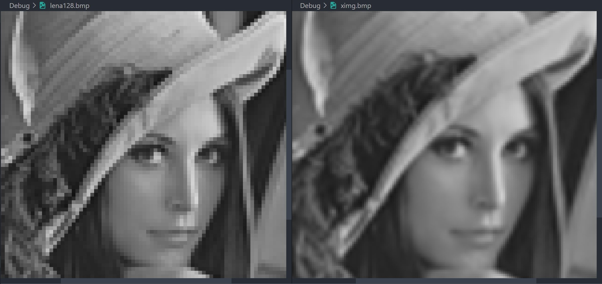

# DSP-HW

中山大学电信院 EIT349 梁凡老师的 DSP 器件原理与应用课程作业（2020 秋）。  
Homework for _Principles and Applications of DSP Devices_, SYSU SEIT, Fall 2020.

**2x bilinear interpolation Demo:**

**欢迎在 [Discussions](https://github.com/atlanswer/DSP-HW/discussions) 讨论，利用 [Issues](https://github.com/atlanswer/DSP-HW/issues) 跟踪代码问题， 以及提交 [PR](https://github.com/atlanswer/DSP-HW/pulls) 分享你的代码。**

### Useful resources

Documents:

- [TMS320C6000 Technical Brief](https://www.ti.com/lit/ug/spru197d/spru197d.pdf)
- [TMS320C6000 Optimizing Compiler v7.4 User's Guide](https://www.ti.com/lit/pdf/spru187)
- [TMS320C6000 Assembly Language Tools v7.4 User's Guide](https://www.ti.com/lit/pdf/spru186)
- [TMS320C64x/C64x+ DSP CPU and Instruction Set Reference Guide](https://www.ti.com/lit/pdf/spru732)
- [TMS320C6000 Programmer's Guide](https://www.ti.com/lit/ug/spru198k)
- [TI-RTOS Kernel (SYS/BIOS) User's Guide](https://www.ti.com/lit/pdf/spruex3)
- [Introduction to TMS320C6000 DSP Optimization](https://www.ti.com/lit/an/sprabf2/sprabf2.pdf)
- [TMS320C6000 Integer Division](https://www.ti.com/lit/an/spra707/spra707.pdf)
- [Performance Tuning with the “Restrict” Keyword](https://processors.wiki.ti.com/images/f/ff/Bartley=Wiki_1.1=Performance_Tuning_with_the_RESTRICT_Keyword.pdf)

Websites:
- [Code Composer Studio User's Guide](https://software-dl.ti.com/ccs/esd/documents/users_guide/index.html)
- [CCS Resource Index](https://www.ti.com/tool/CCSTUDIO)
- [CCS Technical Documents](https://software-dl.ti.com/ccs/esd/documents/ccs_documentation-overview.html)
- [Code Gneration Tools v7.4](https://www.ti.com/tool/download/C6000-CGT-7-4)
- [Customizing the clock and time Functions](https://processors.wiki.ti.com/index.php/Customizing_the_clock_and_time_Functions)
- [TI Processors Wiki](https://processors.wiki.ti.com/)
- [TI DSP Overview](https://www.ti.com/processors/digital-signal-processors/overview.html)

### Usage

#### Test environment

- `Code Composer Studio` v8.3.1 on Windows 10 20H2
    - `TI Code Gneration Tools` v7.4.24

Note: `Texas Instruments Simulators` connection is required to run the CPU cycle accurate simulation without the actual development board, which was only existed in CCS prior to v6. This is the reason why the course recommended CCS v5, but it's quite old. However, there is a hack to migrate the software simulation to newer versions of CCS up to v8.3.1, thus I decided to use it. Code Generation Tools v7.4 is the last version of CGT to support C64/C64+, which was released in 2018.

#### CCS Configuration

- Device:
    - Family: C6000
    - Variant: DaVinci DM64x, TMS320DM648

    Target configs are provided in the file `targetConfigs/TMS320DM648.ccxml`

- Tool-chain:
    - Output format: eabi (ELF)
    - Device endianness: little
    - Linker command file: `DM648.cmd`

    Modified linker command file is provided as `DM648.cmd`.

- Build
    - C6000 Compiler
        - Include Options: Add `${PROJECT_ROOT}/include`
        - Performance Adviser: `--advise:performance=all`
    - C6000 Linker
        - Heap size for C/C++ dynamic memory allocation: `--heap_size=0x200000`

    The program uses `malloc` to dynamically allocate memory for the images. The `.sysmem` section of memory should be adjust to accommodate every images since the default size of 1KB is clearly not enough. More info about the cmd file could be found at [here](https://software-dl.ti.com/ccs/esd/documents/sdto_cgt_Linker-Command-File-Primer.html).

##### Debug Configuration 

- Build
    - C6000 Compiler
        - Optimization: off
        - Debug Options: Full symbolic debug `-g`
        - Advanced Options
            - Predefined Symbols: `--define=DEBUG`
            - Assembler Options: `--keep_asm`

##### Release Configuration

- Build
    - C6000 Compiler
        - Optimization: `-O2`
        - Debug Options: Symbolic debug for program analysis `--symdebug:skeletal`
        - Advanced Options
            - Predefined Symbols: `--define=RELEASE`

Other options are assumed to be default.

#### How to run

Code, build and hit debug!

### Homework List

- [x] 实验 1：用 C 语言实现 8 位 DIB 双线性插值
- [ ] 实验 2：双线性插值函数使用线性汇编语言实现
- [ ] 实验 3：用 C 语言和线性汇编语言完成从 YCbCr 彩色空间到 RGB 彩色空间的转换
- [ ] 实验 4：用 C 语言完成线性变换程序并优化
- [ ] 实验 5：用 C 语言和线性汇编语言实现中值滤波器
- [ ] 实验 6：通过 DSP/BIOS, 利用 C 语言完成工作
